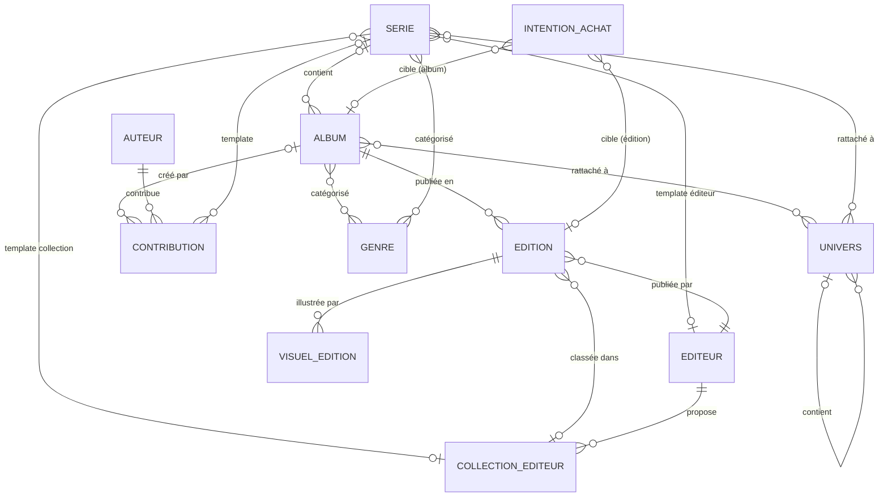

# Modèle Métier

Ce fichier décrit les entités du domaine, leurs attributs et leurs relations.

---

## Domaine

L'application gère une **collection de bandes dessinées (BD)**. Le domaine tourne autour des albums, séries, auteurs et de leur possession par un utilisateur.

---

## Glossaire des entités

| Entité | Définition |
| --- | --- |
| **Album** | Œuvre de bande dessinée suivie dans le catalogue. |
| **Édition** | Manifestation publiée d'un album (format, publication, valeur, etc.). |
| **Série** | Regroupement d'albums dans une continuité éditoriale. |
| **Auteur / Artiste** | Personne ou duo crédité sur un album (scénario, dessin, couleur). |
| **Éditeur** | Entité qui publie des éditions. |
| **Collection éditeur** | Sous-ensemble optionnel rattaché à un éditeur, utilisé pour classer des éditions. |
| **Collection utilisateur** | Ensemble des éditions possédées par l'utilisateur. Ce n'est pas une entité distincte en base : la collection est définie implicitement par les éditions dont le `Mode d'acquisition` est renseigné. |
| **Genre** | Catégorie de contenu (aventure, SF, humour, etc.). |
| **Univers** | Cadre fictionnel auquel albums/séries peuvent être rattachés, avec hiérarchie possible. |
| **Visuel d'édition** | Média rattaché à une édition avec un type de visuel. |
| **Intention d'achat** | Souhait d'acquisition portant sur un album (toute édition) ou sur une édition spécifique. |

---

## Relations et cardinalités

### Album — relations

| Relation | Cardinalité | Remarques |
| --- | --- | --- |
| Album → Édition | 0..n | Un album peut n'avoir aucune édition (non encore publié). |
| Album → Série | 0..1 | Un album peut n'appartenir à aucune série (album standalone). L'attribut `Hors-série` est indépendant : un album peut être hors-série tout en appartenant à une série. |
| Album → Contribution | 0..n | Un album peut avoir plusieurs contributions. Chaque contribution a un rôle et un artiste obligatoire. |
| Album → Genre | 0..n | Genres propres à l'album. Si l'album appartient à une série, les genres affichés sont l'union des genres de l'album et de ceux de la série. |
| Album → Univers | 0..n | Univers propres à l'album. Si l'album appartient à une série, les univers affichés sont l'union des univers de l'album et de ceux de la série. |

### Édition — relations

| Relation | Cardinalité | Remarques |
| --- | --- | --- |
| Édition → Éditeur | 1 | Une édition est toujours publiée par exactement un éditeur. |
| Édition → Collection éditeur | 0..1 | Optionnelle. Si renseignée, doit appartenir à l'éditeur de l'édition. |

### Série — relations

| Relation | Cardinalité | Remarques |
| --- | --- | --- |
| Série → Genre | 0..n | |
| Série → Univers | 0..n | |
| Série → Contribution | 0..n | Contributions template : recopiées sur un album rattaché à la série si l'album n'en a encore aucune. |
| Série → Éditeur | 0..1 | Template pour les nouvelles éditions. |
| Série → Collection éditeur | 0..1 | Template pour les nouvelles éditions. Si renseignée, l'éditeur template doit l'être aussi, et la collection doit lui appartenir. |

### Univers — relations

| Relation | Cardinalité | Remarques |
| --- | --- | --- |
| Univers → Univers parent | 0..1 | Relation récursive permettant une hiérarchie d'univers. Acyclicité obligatoire : un univers ne peut pas être son propre ancêtre (auto-référence interdite, cycles interdits). |

### Intention d'achat — relations

| Relation | Cardinalité | Remarques |
| --- | --- | --- |
| Intention d'achat → Album | 0..1 | Renseignée si l'intention porte sur un album (toute édition acceptable). |
| Intention d'achat → Édition | 0..1 | Renseignée si l'intention porte sur une édition spécifique. |

> **Contraintes :**
>
> - Une intention d'achat doit cibler exactement l'un des deux : un Album ou une Édition, jamais les deux, jamais aucun.
> - Une cible ne fait l'objet que d'**une seule** intention d'achat : un album est visé par au plus une intention, une édition par au plus une intention.
> - Pour un même album, l'intention porte **soit** sur l'album, **soit** sur ses éditions, jamais les deux : un album visé par une intention ne peut pas avoir en même temps une de ses éditions visée par une autre intention, et réciproquement.
> - Une édition **possédée** (`Mode d'acquisition` renseigné) ne peut pas être visée par une intention d'achat.

---

## Schéma des relations

> La **Collection utilisateur** n'est pas une entité en base. Elle est définie par le filtre `Mode d'acquisition IS NOT NULL` sur les éditions.
>
> **Contrainte (Contribution) :** Une contribution appartient à exactement l'un des deux : un Album (contribution réelle) ou une Série (template). Les deux références ne peuvent pas être nulles simultanément, ni renseignées toutes les deux.

---

## Attributs des entités

### Attributs communs à toutes les entités

| Attribut | Type | Obligatoire | Remarques |
| --- | --- | --- | --- |
| Date de création | date et heure | oui | Renseignée automatiquement à la création de la fiche, jamais saisie. |
| Date de dernière modification | date et heure | oui | Renseignée automatiquement à chaque modification de la fiche, jamais saisie. |

### Album

| Attribut | Type | Obligatoire | Remarques |
| --- | --- | --- | --- |
| Titre | texte | conditionnel | Obligatoire si l'album n'appartient à aucune série. Optionnel si une série est rattachée (la série + le tome peuvent suffire à identifier l'album). |
| Clé de tri | texte | non | Calculée automatiquement depuis le titre et stockée explicitement (règle de calcul : voir `fonctionnel.md` § Tri et navigation par initiale). Absente si le titre est absent ; dans ce cas, la clé de tri de la série rattachée est utilisée comme valeur de substitution pour le tri et la navigation par initiale. |
| Clé de tri manuelle | booléen | oui | `false` par défaut. Passe à `true` si l'utilisateur a explicitement modifié la clé de tri. Quand `false`, la clé est recalculée automatiquement à chaque modification du titre. |
| Type | énuméré | oui | `Régulier` (défaut) / `Intégrale`. |
| Hors-série | booléen | oui | `false` par défaut. Indépendant du type : une intégrale peut être hors-série. |
| Numéro de tome | entier | non | |
| Tome de début | entier | conditionnel | Intégrales uniquement : premier tome couvert. Doit être renseigné si et seulement si le tome de fin l'est. |
| Tome de fin | entier | conditionnel | Intégrales uniquement : dernier tome couvert. Doit être renseigné si et seulement si le tome de début l'est. |
| Date de première publication | date partielle | non | Granularité : année seule, ou mois + année. Jamais de date complète (jour inconnu). |
| Résumé | texte long | non | Résumé propre à l'album. |
| Notes personnelles | texte long | non | Annotations libres saisies par l'utilisateur. |
| Note | énuméré (1–5) | non | Appréciation de l'utilisateur : 1 = Très mauvais, 2 = Mauvais, 3 = Moyen, 4 = Bien, 5 = Très bien. |

> **Contrainte (intégrale) :** Les tomes de début et de fin sont solidaires : soit les deux sont renseignés, soit aucun des deux. De plus, `tome de début ≤ tome de fin` est obligatoire. Les tomes référencés par la séquence n'ont pas à exister en tant qu'albums dans la base : il n'y a aucune contrainte d'intégrité référentielle sur cette séquence.

### Série

| Attribut | Type | Obligatoire | Remarques |
| --- | --- | --- | --- |
| Titre | texte | oui | |
| Clé de tri | texte | oui (auto) | Calculée automatiquement depuis le titre et stockée explicitement (règle de calcul : voir `fonctionnel.md` § Tri et navigation par initiale). Toujours présente car le titre est obligatoire. |
| Clé de tri manuelle | booléen | oui | `false` par défaut. Passe à `true` si l'utilisateur a explicitement modifié la clé de tri. Quand `false`, la clé est recalculée automatiquement à chaque modification du titre. |
| Statut | énuméré | non | `En cours` / `Terminée` / `Abandonnée`. `Terminée` signifie que tous les albums prévus par les auteurs ont été publiés. |
| Nombre de tomes numérotés (théorique) | entier | non | Nombre de tomes numérotés attendus dans la séquence principale de la série, selon l'utilisateur. Ne compte pas les hors-série ni les albums sans numéro de tome. Non calculé depuis la base — sert de borne supérieure pour la détection des albums manquants (queue théorique) et à évaluer la complétude de la collection. |
| Complète | booléen | oui | `false` par défaut. Choix explicite de l'utilisateur, indépendant du nombre d'albums réellement présents dans la collection. |
| Exclure des manquants | booléen | oui | `false` par défaut. Si `true`, la série est ignorée lors de la recherche des albums manquants. |
| Exclure des estimations de sortie | booléen | oui | `false` par défaut. Si `true`, la série ne fait l'objet d'aucune estimation de sortie, quel que soit son statut. |
| Résumé | texte long | non | Résumé propre à la série. |
| Notes personnelles | texte long | non | Annotations libres saisies par l'utilisateur. |
| *(template)* Reliure | énuméré | non | Valeur par défaut pour les nouvelles éditions. |
| *(template)* Orientation | énuméré | non | Valeur par défaut pour les nouvelles éditions. |
| *(template)* Sens de lecture | énuméré | non | Valeur par défaut pour les nouvelles éditions. |
| *(template)* Format | énuméré | non | Valeur par défaut pour les nouvelles éditions. |
| *(template)* Catégorie d'édition | énuméré | non | Valeur par défaut pour les nouvelles éditions. |
| *(template)* État | énuméré | non | Valeur par défaut pour les nouvelles éditions. |
| *(template)* En couleur | booléen | non | Valeur par défaut pour les nouvelles éditions. |

> Le formulaire de création d'une série pré-remplit ses valeurs template avec les **valeurs par défaut** des attributs correspondants de l'édition (cf. § Édition) ; elles restent modifiables, et ne sont pas portées par la base (aucune clause `DEFAULT`).

### Édition

| Attribut | Type | Obligatoire | Remarques |
| --- | --- | --- | --- |
| Année d'édition | entier (année) | non | Année de publication de cette édition. |
| ISBN | texte | non | Formats **ISBN-10** et **ISBN-13/EAN-13** tous deux supportés. La saisie doit permettre de détecter les erreurs de frappe (contrôle du chiffre de vérification). |
| Reliure | énuméré | non | `Brochée` / `Cartonnée`. Proposé à la saisie : `Cartonnée`. |
| Orientation | énuméré | non | `Portrait` / `Italienne`. Proposé à la saisie : `Portrait`. |
| Sens de lecture | énuméré | non | `Gauche à droite` / `Droite à gauche`. Proposé à la saisie : `Gauche à droite`. |
| Format | énuméré | non | `Poche` / `Moyen (A5)` / `Normal (A4)` / `Grand (> A4)` / `Spécial`. Proposé à la saisie : `Normal (A4)`. |
| Nombre de pages | entier | non | |
| Catégorie | énuméré | non | `Édition originale` / `Édition spéciale` / `Tirage de tête`. |
| Dédicacée | booléen | oui | `false` par défaut. |
| En couleur | booléen | oui | `true` par défaut. |
| État | énuméré | non | `Excellent (état neuf)` / `Très bon` / `Bon` / `Moyen` / `Mauvais` / `Très mauvais`. « Excellent » plutôt que « Neuf » : une édition qui n'a pas été achetée neuve peut être dans cet état. Proposé à la saisie : `Excellent (état neuf)`. |
| Mode d'acquisition | énuméré | conditionnel | `Achat` / `Offerte` / `Échange` / `Gagnée` / `Héritée`. Obligatoire si l'édition est possédée. Conditionne le libellé de la date et du montant en interface (voir `fonctionnel.md`). |
| D'occasion | booléen | oui | `false` = neuve, `true` = occasion. |
| Date d'acquisition | date | non | Date à laquelle l'utilisateur a obtenu l'édition. |
| Prix d'acquisition | montant + devise (code **ISO 4217 alpha-3**, cf. `choix-implementation.md` § Représentation de la devise) | non | Optionnel. `null` = aucun montant enregistré (prix inconnu ou non applicable). Pour une édition achetée, c'est le prix payé au moment de l'acquisition. Pour les modes sans transaction financière (ex. `Offerte`, `Héritée`), le champ peut accueillir une valeur marchande connue. Stocké dans sa devise ; converti en euro à l'usage, au taux de sa date de référence (cf. `fonctionnel.md` § Gestion des devises). |
| Gratuite | booléen | oui | `false` par défaut. Indique que l'édition **n'a pas de valeur** : aucun montant n'est enregistré (ni prix payé, ni valeur marchande, ni valeur initiale) et aucune valeur n'est estimée. Interdit pour une édition achetée. Si `true`, le prix d'acquisition et la valeur initiale doivent être `null` (contrainte d'intégrité) ; ces champs sont désactivés et vidés en interface. |
| Valeur initiale | montant + devise | non | Prix de vente de l'édition à sa parution. Stocké dans sa devise ; converti en euro à l'usage, au taux de sa date de référence (cf. `fonctionnel.md` § Gestion des devises). |
| Numérotation personnelle | texte | non | Référence libre saisie par l'utilisateur (ex. cote, numéro de rangement). |
| Valeur estimée | calculée | — | Estimation du prix d'acquisition d'une édition possédée, non gratuite, dont le prix d'acquisition n'est pas renseigné (voir `fonctionnel.md` § Estimation de la valeur des éditions). Calculée dynamiquement, non stockée. |
| Notes personnelles | texte long | non | Annotations libres saisies par l'utilisateur. |

> **Valeurs par défaut des attributs énumérés** (État, Reliure, Orientation, Sens de lecture, Format) : ce sont uniquement des valeurs **proposées à la saisie**, qui pré-remplissent le formulaire de création. Elles ne sont **pas portées par la base** (aucune clause `DEFAULT` sur les colonnes correspondantes) ni appliquées à l'enregistrement : un attribut laissé vide est enregistré vide.

> **Contraintes d'intégrité :**
>
> - Si `Mode d'acquisition` est `null` (édition non possédée, ex. issue d'une intention d'achat), alors `Date d'acquisition`, `Prix d'acquisition` et `Valeur initiale` doivent également être `null` : une édition non possédée n'a pas de valeur.
> - Si `Gratuite` est `true`, alors `Prix d'acquisition` et `Valeur initiale` doivent être `null` : une édition gratuite n'a pas de valeur.
> - Si `Mode d'acquisition` est `Achat`, alors `Gratuite` doit être `false` : une édition achetée ne peut pas être gratuite.
> - Si `Prix d'acquisition` est renseigné, au moins une de ses dates de référence doit être connue : `Date d'acquisition`, `Année d'édition` ou `Date de première publication` de l'album.
> - Si `Valeur initiale` est renseignée, `Année d'édition` ou `Date de première publication` de l'album doit être connue.

### Auteur / Artiste

| Attribut | Type | Obligatoire | Remarques |
| --- | --- | --- | --- |
| Nom | texte | non | |
| Prénom | texte | non | |
| Pseudonyme | texte | non | |
| Biographie | texte long | non | |
| Nationalité | texte | non | |

> **Contraintes :** Au moins un des champs Nom ou Pseudonyme doit être renseigné. Un auteur peut représenter un duo ou collectif (ex. deux auteurs créditant sous un nom commun).

### Contribution *(relation Album ↔ Auteur/Artiste)*

| Attribut | Type | Obligatoire | Remarques |
| --- | --- | --- | --- |
| Rôle | énuméré | oui | `Scénariste` / `Dessinateur` / `Coloriste`. |
| Auteur/Artiste | référence | oui | Toute contribution est nécessairement associée à un artiste identifié. |

> Un artiste peut être associé à plusieurs rôles sur le même album (ex. scénariste et dessinateur). Chaque combinaison album + rôle + artiste constitue une ligne de contribution distincte.

### Éditeur

| Attribut | Type | Obligatoire |
| --- | --- | --- |
| Nom | texte | oui |
| Site web | URL | non |

> **Contrainte :** le nom d'un éditeur est **unique tel que saisi** : deux éditeurs ne peuvent pas porter exactement le même nom, mais des noms ne différant que par la casse (ex. `Dargaud` et `dargaud`) restent distincts.

### Collection éditeur

| Attribut | Type | Obligatoire |
| --- | --- | --- |
| Nom | texte | oui |

### Genre

| Attribut | Type | Obligatoire |
| --- | --- | --- |
| Libellé | texte | oui |

> **Contrainte :** le libellé d'un genre est **unique sans tenir compte de la casse ni des accents** : `Aventure`, `aventure` et `AVENTURE` désignent le même genre, de même que `Épopée` et `Epopee`.

### Univers

| Attribut | Type | Obligatoire | Remarques |
| --- | --- | --- | --- |
| Nom | texte | oui | |
| Description | texte long | non | |

### Visuel d'édition

| Attribut | Type | Obligatoire | Remarques |
| --- | --- | --- | --- |
| Type de visuel | énuméré | oui | Couverture / Dédicace / Page de garde / Planche / 4e de couverture. `Couverture` proposé par défaut à la saisie (formulaire pré-rempli), non porté par la base (aucune clause `DEFAULT`). |
| Fichier / URL | texte | oui | Référence au média stocké. |
| Ordre d'affichage | entier | oui | Rang au sein des visuels du même type, ajustable manuellement par l'utilisateur. |

### Intention d'achat

| Attribut | Type | Obligatoire | Remarques |
| --- | --- | --- | --- |
| Cible album | référence | conditionnel | Album visé. Renseigné si l'intention porte sur un album (toute édition). Exclusif avec "Cible édition". |
| Cible édition | référence | conditionnel | Édition visée. Renseignée si l'intention porte sur une édition spécifique. Exclusive avec "Cible album". |

> **Contraintes :** Exactement l'un des deux champs "Cible album" ou "Cible édition" doit être renseigné. Une même cible (album ou édition) ne peut être visée que par une seule intention d'achat. Un album et l'une de ses éditions ne peuvent pas être visés simultanément. Une édition possédée (`Mode d'acquisition` renseigné) ne peut pas être visée.
